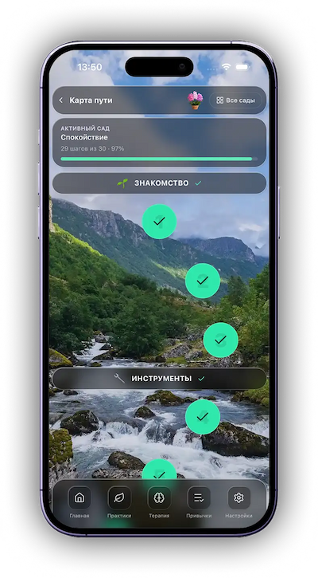
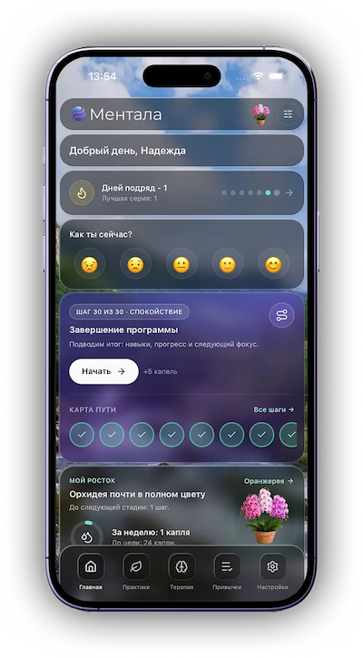

# Mentala

Mentala: AI-продукт для поддержки психического здоровья. В репозитории находятся веб-приложение и мобильные приложения для iOS и Android, API, AI-функции в реальном времени, подписки и уведомления.

Сайт: [mentala.app](https://mentala.app)

## Моя роль

Я создал Mentala как собственный продукт и довел его от архитектуры и разработки до production-релиза. Отвечал за frontend-архитектуру, Vue 3 и Nuxt, интеграции с API, подписки, push-уведомления, а также публикацию приложений в App Store и Google Play.

## Стек

- Vue 3, Nuxt 4, TypeScript, Pinia
- Nitro, PostgreSQL, Drizzle ORM, Redis, BullMQ, Zod
- Tailwind CSS, shadcn-vue, Vitest
- Capacitor, App Store, Google Play

## Архитектура

- [Описание продукта](.docs/PROJECT_DESCRIPTION.md)
- [Общая архитектура](.docs/architecture.md)
- [Память AI-чата](.docs/arch_chat_memory.md)
- [Подписки](.docs/arch_billing.md)
- [Уведомления](.docs/arch_notifications.md)
- [Безопасность](.docs/security_requirements.md)

## Локальный запуск

Потребуются Node.js 20+, pnpm, PostgreSQL и Redis.

```bash
pnpm install
cp .env.example .env
pnpm dev
```

## Проверки качества

```bash
pnpm lint
pnpm test
pnpm build
```
