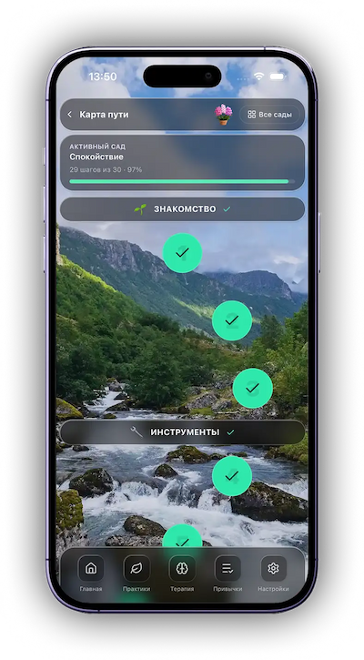
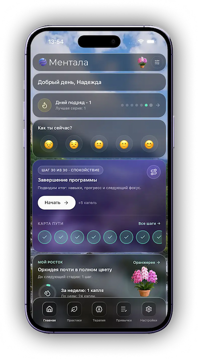

# Mentala

AI-powered self-care and habit support product for web, iOS, and Android.

[Live product](https://mentala.app)




## Product

Mentala brings together AI-powered conversations, habit support, breathing practices, and meditation content in one cross-platform product.

The application is designed for web and mobile delivery, with shared product flows across the browser, iOS, and Android.

## Main Capabilities

- AI-powered conversations with personalised context
- Habit support, progress tracking, and reminders
- Breathing practices and meditation content
- Subscription and access-control flows
- Web, iOS, and Android delivery from a shared codebase

## Stack

- **Frontend:** Nuxt 4, Vue 3, TypeScript, Pinia, Tailwind CSS, Vue Query
- **Backend:** Nitro, Drizzle ORM, PostgreSQL, Redis, BullMQ
- **Platform:** Capacitor, Docker
- **Quality:** Vitest, ESLint, Zod

## Architecture

Mentala is organised as a full-stack Nuxt application:

```text
app/                    Vue application: pages, components, stores, and composables
server/api/             Thin HTTP handlers
server/application/     Use cases and business logic
server/domain/          Domain models and rules
server/infrastructure/  Database, Redis, queues, and external providers
server/interface/       Ports and integration contracts
shared/dto/             Shared validation schemas and API contracts
```

Capacitor packages the web application for iOS and Android while preserving the shared product and frontend architecture.
